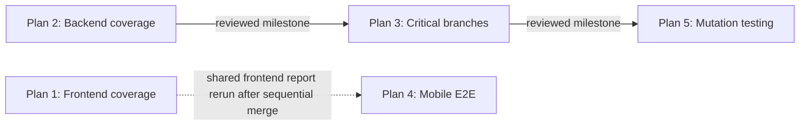

# Test Quality Priorities Execution Index

> **Execution style:** Use `superpowers:subagent-driven-development` in isolated worktrees. Each task receives a fresh implementer and the required fresh reviewer named by its authoritative plan.
>
> **Authority rule:** This index coordinates the five plans; it does not replace or override them. The linked plan is authoritative for task scope, commands, acceptance criteria, artifacts, and task-level handoff instructions. If this index and a plan differ, stop and reconcile the index to the reviewed plan before dispatching work.

## Plan set and measurable outcomes

| Plan | Authoritative plan | Independent metric and completion target |
|---|---|---|
| 1 | [Frontend coverage uplift](2026-07-31-frontend-coverage-uplift.md) | From 484/1,034 statements and 317/729 branches to at least 621/1,034 statements and 438/729 branches (both at least 60%). Preserve a quantified backlog to 776/1,034 statements and 547/729 branches (both at least 75%). |
| 2 | [Backend coverage uplift](2026-07-31-backend-coverage-uplift.md) | From 1,848/2,815 branches (65.64%) to at least 1,971/2,815 branches (70.00%); forecast is 1,979/2,815 (70.30%). Statements must remain at or above 2,497/3,659 (68.24%), functions at or above 427/605 (70.57%), and lines at or above 2,406/3,496 (68.82%). |
| 3 | [Critical-module branch hardening](2026-07-31-critical-module-branch-hardening.md) | Every designated critical module reaches at least 85% branch coverage, with 90% used where the reviewed plan identifies a high-value target. Stable covered/total pairs are token session 88/103, repair 94/110, reconciliation 163/191, members 160/188, borrowings 105/116, and permission control at least 71/74. |
| 4 | [Mobile Playwright skip elimination](2026-07-31-mobile-playwright-skip-elimination.md) | The authoritative E2E report records 87/87 passed, 0 failed, 0 flaky, and 0 skipped across all configured projects. Mobile retains the existing 2,000 ms performance-risk budget. |
| 5 | [Selective critical-backend mutation testing](2026-07-31-selective-mutation-testing.md) | The raw combined mutation score across exactly five selected services is at least 70% and never decreases. No `Survived` or `NoCoverage` mutant overlapping a reviewed authorization, ownership, revocation, or illegal-state rule may remain unless its exact fingerprint is independently reviewed as equivalent. PR smoke runtime is at most 300,000 ms and scheduled complete runtime is at most 900,000 ms on `ubuntu-24.04`, Node 22. |

The three project-level metrics remain independent:

1. Backend unit/integration coverage.
2. Frontend unit/component coverage.
3. E2E pass rate and health.

Mutation score is a separate critical-module effectiveness measure. It must not be folded into, averaged with, or used to conceal any of the three project-level metrics.

## Dependency graph



Plan 1, Plan 2, and Plan 4 may begin concurrently in separate worktrees. Plan 4 has no implementation dependency on Plan 1, but their frontend changes and reports must merge sequentially: merge Plan 1 first, then rebase and merge Plan 4, then regenerate all frontend and E2E reports. Plan 3 may begin only after the complete Plan 2 milestone is merged and reviewed. Plan 5 may begin only after the complete Plan 3 milestone is merged and reviewed.

## Milestone gates

| Gate | Opens | Required evidence |
|---|---|---|
| G0 — dispatch ready | Plans 1, 2, and 4 | Isolated worktree, recorded base SHA, clean status, dependency install verified, plan-specific ledger initialized, and explicit model/reasoning recorded for the first task. |
| G1 — backend breadth reviewed | Plan 3 | Plan 2 tasks 1–7 complete; backend branches at least 1,971/2,815; other backend metrics nondecreasing; shared backend fixtures available; fresh whole-plan review accepted; Plan 2 reports and ledger complete. |
| G2 — critical branches reviewed | Plan 5 | Plan 3 tasks 1–10 complete; every designated critical module meets its stable covered/total pair; permission control is at least 71/74; all security, concurrency, and lifecycle review findings closed; Plan 3 reports and ledger complete. |
| G3 — frontend merge accepted | Plan 4 merge | Plan 1 merged; statements and branches both at least 60%; the 75% backlog preserved; the frontend object in the shared baseline equals its per-scope maximum; frontend reports regenerated. |
| G4 — mobile E2E accepted | Integrated release verification | Plan 4 rebased after Plan 1; 87/87 passed; no failed, flaky, or skipped tests; the 2,000 ms budget unchanged; authoritative E2E report regenerated. |
| G5 — mutation milestone accepted | Integrated release verification | Plan 5 score at least 70%; no unapproved critical survivor; PR smoke at most 5 minutes; scheduled complete at most 15 minutes; reports and equivalent-mutant decisions complete. |

Passing a numeric gate is necessary but insufficient. The required fresh reviewer must also accept the task or milestone, and all ledger and report artifacts must be present.

## Concurrency policy

### Allowed

- Develop Plans 1, 2, and 4 concurrently in separate worktrees.
- After Gate G1, develop Plan 3 concurrently with unfinished Plan 1 or Plan 4 work in separate worktrees; keep all merges and shared report production sequential.
- After Gate G2, develop Plan 5 concurrently with unfinished Plan 1 or Plan 4 work only after confirming neither lane will modify Plan 5's package manifests, selected service specs, mutation quality files, or workflow.
- Run read-only inventories or independent task reviews concurrently when they do not consume or rewrite the same generated report.
- Within a plan, dispatch only the tasks explicitly marked parallel by that plan.
- Prepare Plan 4 while Plan 1 is active, provided Plan 4 does not merge first and does not publish an authoritative frontend coverage report before the sequential frontend integration.

### Prohibited

- Do not start Plan 3 before Gate G1.
- Do not start Plan 5 before Gate G2.
- Do not run Plan 3 concurrently with unfinished Plan 2 work.
- Do not run Plan 5 concurrently with work that modifies `package.json`, `package-lock.json`, its five selected service specs, `scripts/quality`, `test/quality`, or `.github/workflows/mutation.yml`.
- Do not edit `quality/coverage-baselines.json` concurrently.
- Do not merge Plan 1 and Plan 4 concurrently.
- Do not let Plan 4's repeat-run JSON replace the authoritative full E2E report.
- Do not run two producers that overwrite the same coverage, E2E, mutation, or ledger artifact at the same time.
- Do not assign implementation and fresh review of the same task to the same agent.
- Do not dispatch a task without its exact model, reasoning level, reviewer model, and reviewer reasoning level recorded first.

## Shared-file and conflict matrix

| Resource | Plan 1 | Plan 2 | Plan 3 | Plan 4 | Plan 5 | Coordination rule |
|---|---:|---:|---:|---:|---:|---|
| `quality/coverage-baselines.json` frontend object | Owner | Preserve | Preserve | No write | Preserve | Plan 1 writes only the frontend object. Keep the per-scope maximum; never replace it with a lower observation. |
| `quality/coverage-baselines.json` backend object | Preserve | Owner | Successor owner | Preserve | Preserve | Plans 2 then 3 write the backend object in dependency order. Keep the per-scope maximum; never replace it with a lower observation. |
| `test/support/backend-coverage-fixtures.ts` | — | Producer | Consumer | — | Indirect consumer | Plan 2 owns the initial fixture contract. Plan 3 imports its exact reviewed exports and may extend only compatibly. |
| Backend critical-module tests | — | Boundary only | Owner | — | Consumer/hardener | Plan 2 must not consume Plan 3's deep critical-module scope. Plan 5 mutates against the stable Plan 3 suite and changes tests only to kill reviewed mutants. |
| Frontend unit/component tests | Owner | — | — | Preserve | — | Plan 4 rebases after Plan 1 and reruns the frontend report before merge. |
| Playwright specs and E2E report | Preserve | — | — | Owner | — | Plan 4 owns skip removal and the authoritative 87-test E2E report. |
| Coverage report directories | Producer | Producer | Producer | Read/preserve | Read | Use each plan's exact commands and do not run overlapping report producers in one worktree. |
| `package.json` and `package-lock.json` | Preserve | Preserve | Preserve | Conditional/shared | Owner in Task 1/7 | Do not run Plan 5 concurrently with any package-manifest work. Plan 5 pins Stryker without upgrading Jest or ts-jest. |
| `scripts/quality`, `test/quality`, and `.github/workflows/mutation.yml` | Preserve | Preserve | Preserve | Shared/read-only quality tooling | Owner for mutation files only | Plan 5 may add only its declared mutation policy, runner, manifest, allowlist, baseline, tests, and separate workflow. Existing quality workflows and thresholds remain unchanged. |
| Mutation reports and configuration | — | — | Prerequisite producer | — | Owner | Plan 5 owns `stryker.config.mjs`, policy/runner tooling, and generated `reports/mutation/**`; generated reports stay untracked. |
| `.superpowers/sdd/**` ledgers | Own ledger | Own ledger | Own ledger | Own ledger | Own ledger | One ledger per plan. Never write another plan's task report. |

When a merge conflict touches the shared baseline, retain the maximum accepted value independently for each backend and frontend metric. Regenerate the relevant report after the merge; do not resolve from memory or by taking one entire side of the file.

## Predecessor artifacts and interfaces

### Plan 2 to Plan 3

Plan 3 must record the reviewed Plan 2 merge SHA before its first task. It consumes:

- `test/support/backend-coverage-fixtures.ts`, including the reviewed deferred-promise, query-result, staff-document, and model-harness exports;
- the authoritative backend coverage summary and exact denominator;
- the Plan 2 task reports and whole-plan review;
- the backend baseline object using per-scope maxima.

If an expected export, behavior, or report differs from the Plan 2 handoff, stop Plan 3 and reconcile the interface; do not silently fork the fixture contract.

### Plan 3 to Plan 5

Plan 5 must record the reviewed Plan 3 merge SHA before its first task. It consumes:

- the reviewed critical-module inventory and stable covered/total branch pairs;
- the hardened tests for token sessions, repair, reconciliation, members, borrowings, and permission control;
- Plan 3's lifecycle, security, ownership, revocation, and illegal-state scenario inventory;
- the Plan 2 fixture exports `deferred`, `queryResult`, `createStaffDocument`, `createStaffModelHarness`, and `createIdentifierModelHarness` from `test/support/backend-coverage-fixtures.ts`;
- the Plan 3 fixture exports `createRefreshFamily`, `createReplayMarker`, `createIdentifierOperation`, `createMemberDocument`, `createBorrowingDocument`, `CriticalQueryDouble`, `criticalQueryResult`, and `createCriticalModelHarnesses` from `test/support/critical-auth-fixtures.ts`;
- Plan 3 task reports, reviewer decisions, and whole-plan review.

If a critical test is flaky, nondeterministic, or dependent on shared process state, stop mutation dispatch for that module until Plan 3 is repaired and re-reviewed.

Plan 5 mutates, but does not edit, exactly:

- `src/auth/token-session.service.ts`;
- `src/auth/auth-identifier-repair.service.ts`;
- `src/auth/auth-identifier-reconciliation.service.ts`;
- `src/members/members.service.ts`;
- `src/borrowings/borrowings.service.ts`.

It produces Stryker JSON/HTML and duration evidence, a source-hashed critical-rule manifest, an exact-fingerprint equivalent-mutant allowlist, an upward-only raw-score baseline, and fail-closed policy checks. These mutation artifacts remain independent from coverage and E2E metrics.

### Plan 1 to Plan 4 integration

Plan 4 has no feature dependency on Plan 1. Its merge handoff nevertheless consumes the merged Plan 1 frontend source state, frontend coverage report, and frontend baseline object. After rebasing Plan 4, regenerate both the frontend coverage report and the full E2E report. Neither pre-rebase report is authoritative.

## Model and reviewer matrix

Every row is an explicit dispatch requirement. “Fresh reviewer” means an agent that did not implement that task.

| Plan | Phase/tasks | Work class | Implementer | Required fresh reviewer |
|---|---|---|---|---|
| 1 | Task 0 — freeze execution base and create the SDD evidence contract | Bootstrap, inventory, ledger, baseline evidence | `gpt-5.6-terra`, medium reasoning | `gpt-5.6-terra`, high reasoning |
| 1 | Tasks 1–4 — API/query-key contracts; staff console; staff detail; member workflows | Frontend API, staff, and member coverage | `gpt-5.6-terra`, high reasoning | `gpt-5.6-terra`, high reasoning |
| 1 | Task 5 — router, shared login, and authorization boundaries | Router and authentication behavior | `gpt-5.6-sol`, high reasoning | `gpt-5.6-sol`, high reasoning |
| 1 | Task 6 — fresh ratchet and whole-plan review | Coverage ratchet, changed-line evidence, whole-plan verification | `gpt-5.6-sol`, high reasoning | `gpt-5.6-sol`, high reasoning |
| 2 | Task 1 — reusable fixtures and staff-account lifecycle | Reservations, revocation, and lifecycle | `gpt-5.6-sol`, high reasoning | `gpt-5.6-sol`, high reasoning |
| 2 | Task 2 — shared-auth response and controller adapters | Authentication and session adapters | `gpt-5.6-sol`, high reasoning | `gpt-5.6-sol`, high reasoning |
| 2 | Tasks 3–5 — readiness/errors/pagination; controllers; middleware | Broad deterministic backend behavior coverage | `gpt-5.6-terra`, high reasoning | `gpt-5.6-terra`, high reasoning |
| 2 | Task 6 — fresh evidence and monotonic ratchet | Baseline and integration security | `gpt-5.6-sol`, high reasoning | `gpt-5.6-sol`, high reasoning |
| 2 | Task 7 — whole-plan review and Plan 3 handoff | Whole-plan verification and interface handoff | `gpt-5.6-sol`, high reasoning | `gpt-5.6-sol`, high reasoning |
| 3 | Tasks 1–10 — refresh race; repair validation/recovery; reconciliation races/recovery; member identifier/lifecycle; borrowing/permission; ratchet; handoff | Security, ownership, concurrency, lifecycle, critical branches, and whole-plan review | `gpt-5.6-sol`, high reasoning | `gpt-5.6-sol`, high reasoning |
| 4 | Task 1 — clean baseline and deterministic readiness | Baseline inventory and executable readiness evidence | `gpt-5.6-terra`, medium reasoning | `gpt-5.6-terra`, high reasoning |
| 4 | Task 2 — seeded-scale mobile performance contract | Mobile readiness/performance implementation | `gpt-5.6-terra`, high reasoning | `gpt-5.6-terra`, high reasoning |
| 4 | Task 3 — repetition gate and report/parser proof | Repeat-run and report validation | `gpt-5.6-terra`, high reasoning | `gpt-5.6-terra`, high reasoning |
| 4 | Task 4 — repository verification and Plan 1 merge contract | Full-matrix report and whole-plan verification | `gpt-5.6-sol`, high reasoning | `gpt-5.6-sol`, high reasoning |
| 5 | Task 0 — lock reviewed Plan 3 base and establish evidence ledger | Inventory and dependency lock | `gpt-5.6-terra`, medium reasoning | `gpt-5.6-sol`, high reasoning |
| 5 | Tasks 1–4 — pin Stryker 9.6.1; policy parser; critical-rule manifest/allowlist; configuration/runner | Mutation infrastructure and fail-closed policy | `gpt-5.6-sol`, high reasoning | `gpt-5.6-sol`, high reasoning |
| 5 | Tasks 5–6 — kill auth repair/reconciliation and member/borrowing mutants; establish baseline | Critical-mutant hardening | `gpt-5.6-sol`, high reasoning | `gpt-5.6-sol`, high reasoning |
| 5 | Tasks 7–9 — package scripts/workflow; reference-runner budgets; independent handoff | CI, runtime acceptance, and whole-plan assurance | `gpt-5.6-sol`, high reasoning | `gpt-5.6-sol`, high reasoning; Task 9 requires a different fresh reviewer |

For every grouped range, the same assignment applies independently to every task in that range. Dispatchers must still record the requested and actual model/reasoning separately in every task report before work starts.

### Model substitution rule

A substitution is allowed only when the replacement is equal or better for the assigned work. Record the requested model/reasoning, actual model/reasoning, reason, and approving reviewer in the task report before execution. Never downgrade security, concurrency, lifecycle, mutation-analysis, ratchet, or whole-plan work below `gpt-5.6-sol` with high reasoning. A missing model or reasoning record is a stop condition, not implicit permission to use a default.

## Ledger and report ownership

| Plan | Ledger root | Required task reports |
|---|---|---|
| 1 | `.superpowers/sdd/2026-07-29-frontend-coverage-uplift` | `task-00-bootstrap.md`, `task-01-api-contracts.md`, `task-02-staff-console.md`, `task-03-staff-details.md`, `task-04-member-workflows.md`, `task-05-routing-auth.md`, and `task-06-final-ratchet.md` |
| 2 | `.superpowers/sdd/2026-07-29-plan-2-backend-coverage` | `task-01.md` through `task-07.md` |
| 3 | `.superpowers/sdd/2026-07-29-plan-3-critical-module-branch-hardening` | Paired `task-01-report.md` / `task-01-review.md` through `task-10-report.md` / `task-10-review.md` |
| 4 | `.superpowers/sdd/2026-07-29-mobile-playwright-skip-elimination` | `task-01.md` through `task-04.md` |
| 5 | `.superpowers/sdd/2026-07-31-plan-5-selective-mutation-testing` | `task-00.md` through `task-09.md`, plus `review.md` |

Each task report must contain:

- plan and task identifier;
- predecessor merge SHA and working base SHA;
- requested implementer model and reasoning;
- actual implementer model and reasoning;
- requested reviewer model and reasoning;
- actual reviewer model and reasoning;
- substitution reason and approval, or `none`;
- files changed;
- tests and verification commands with exit status;
- metric numerator, denominator, percentage, and delta where applicable;
- report/artifact paths;
- reviewer findings, resolutions, and final decision;
- remaining risks and explicit handoff notes.

The plan ledger is append-only evidence. Do not rewrite an earlier task result to make a later measurement look cleaner.

## Recommended subagent-driven dispatch sequence

### Wave A — independent preparation and implementation

1. Create separate isolated worktrees for Plans 1, 2, and 4.
2. Dispatch each plan's bootstrap/baseline task to the model in the matrix.
3. After each bootstrap review passes, continue its authoritative task order.
4. Allow the three worktrees to run concurrently, but serialize any local report producer that targets a shared physical output path.
5. Keep Plan 4 unmerged until Plan 1 passes Gate G3.

### Wave B — backend breadth to critical depth

1. Complete and freshly review all Plan 2 tasks.
2. Merge Plan 2 and record its merge SHA in the Plan 3 ledger.
3. Confirm Gate G1 from regenerated backend coverage, not from Plan 2's forecast.
4. Create the Plan 3 worktree from that exact reviewed merge and dispatch Tasks 1–10 in the authoritative order.
5. Merge Plan 3 only after every stable module pair and the whole-plan review pass.

### Wave C — mutation effectiveness

1. Record the reviewed Plan 3 merge SHA in the Plan 5 ledger.
2. Confirm Gate G2 and stable deterministic tests before mutation tooling work.
3. Dispatch Plan 5 according to its exact task/model matrix.
4. Treat every surviving critical mutant as a concrete review item: kill it, prove and record equivalence, or stop.
5. Merge only after mutation score, survivor, and runtime gates all pass.

### Wave D — frontend integration

1. Merge reviewed Plan 1.
2. Regenerate frontend coverage and verify Gate G3.
3. Rebase reviewed Plan 4 on the resulting integration head.
4. Resolve conflicts by preserving Plan 1's accepted frontend tests and baseline maxima.
5. Run Plan 4's full authoritative E2E producer; then regenerate frontend coverage.
6. Merge Plan 4 only after Gate G4 passes on the rebased source.

### Default total merge order

Use `Plan 2 → Plan 3 → Plan 5 → Plan 1 → Plan 4` when a single release branch needs one deterministic total order. The dependency lanes may finish at different times, but this total order avoids ambiguous baseline and report ownership. If release coordination selects a different interleaving, it must still preserve `Plan 2 → Plan 3 → Plan 5` and `Plan 1 → Plan 4`, with one merge at a time.

## Stop conditions

Stop the affected task or lane and escalate to its plan owner when any of the following occurs:

- the required predecessor milestone or reviewed merge SHA is absent;
- a coverage denominator differs from the plan without an explained, reviewed source-set change;
- any ratcheted metric decreases, even if another metric improves;
- a task's actual scope overlaps a later plan's reserved scope;
- an expected predecessor export, fixture behavior, report, or interface is missing or incompatible;
- an implementer/reviewer model is below policy or its substitution was not recorded before dispatch;
- implementation and fresh review are assigned to the same agent;
- a generated report would overwrite another authoritative report;
- a shared-baseline conflict cannot be resolved from regenerated evidence and per-scope maxima;
- a critical test is flaky or nondeterministic;
- any E2E test is failed, flaky, or skipped;
- the mobile 2,000 ms risk budget changes;
- mutation runtime exceeds 5 minutes for PR smoke or 15 minutes for scheduled complete;
- an auth, ownership, revocation, or illegal-state mutant survives without a reviewed equivalent-mutant record;
- lint, tests, report validation, or fresh review fails.

Do not lower a target, exclude a file, increase a timeout, mark a test skipped, or declare a mutant equivalent merely to pass a gate.

## Integrated verification

Run this after all five plans are merged, from a clean integration worktree. Use each authoritative plan's report command for its owned artifact, then run the cross-plan checks below. The root ESLint command is deliberately non-mutating.

```powershell
npm run test:quality-reporting
npm run test:cov
npm run test:e2e:report
npm run quality:report:backend
npm run frontend:test:coverage
npm run quality:report:frontend-unit
npm run frontend:test:e2e:report
npm run quality:report:frontend-e2e
npx eslint "{src,apps,libs,test}/**/*.ts"
npm run frontend:lint
npm run build
npm run frontend:build
git diff --check
```

Then run the Plan 5 policy, PR-smoke, and scheduled-complete commands:

```powershell
npm run mutation:check
npm run mutation:smoke
npm run mutation:complete
```

Confirm:

- backend branches are at least the Plan 3 post-hardening maximum and no backend metric decreased;
- every critical module matches or exceeds its stable covered/total pair;
- frontend statements are at least 621/1,034 and branches at least 438/729;
- the frontend 75% backlog remains quantified at 776 statements and 547 branches;
- E2E is 87/87 passed with zero failed, flaky, or skipped;
- mobile performance retains the 2,000 ms budget;
- selected-module mutation score is at least 70%;
- there is no unapproved critical surviving mutant;
- PR smoke runtime is at most 5 minutes and scheduled complete runtime is at most 15 minutes;
- `quality/coverage-baselines.json` retains the accepted maximum independently for each backend and frontend metric;
- all plan ledgers, task reports, generated reports, and fresh whole-plan reviews are present.

Any failure leaves the integrated milestone incomplete. Route the repair back to the plan that owns the metric or artifact, re-review it with that plan's required reviewer model, and repeat integrated verification.
